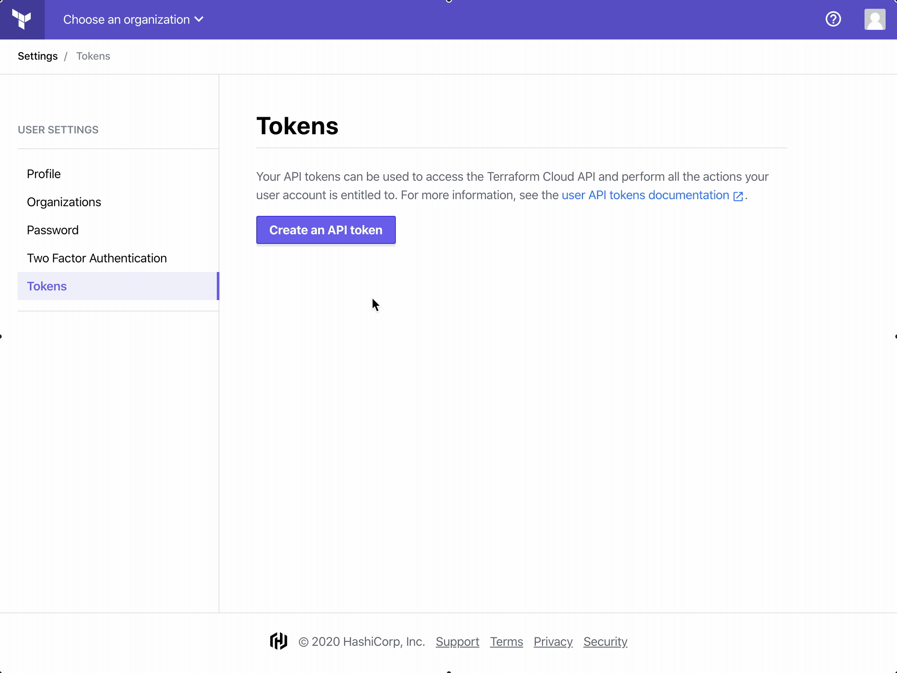
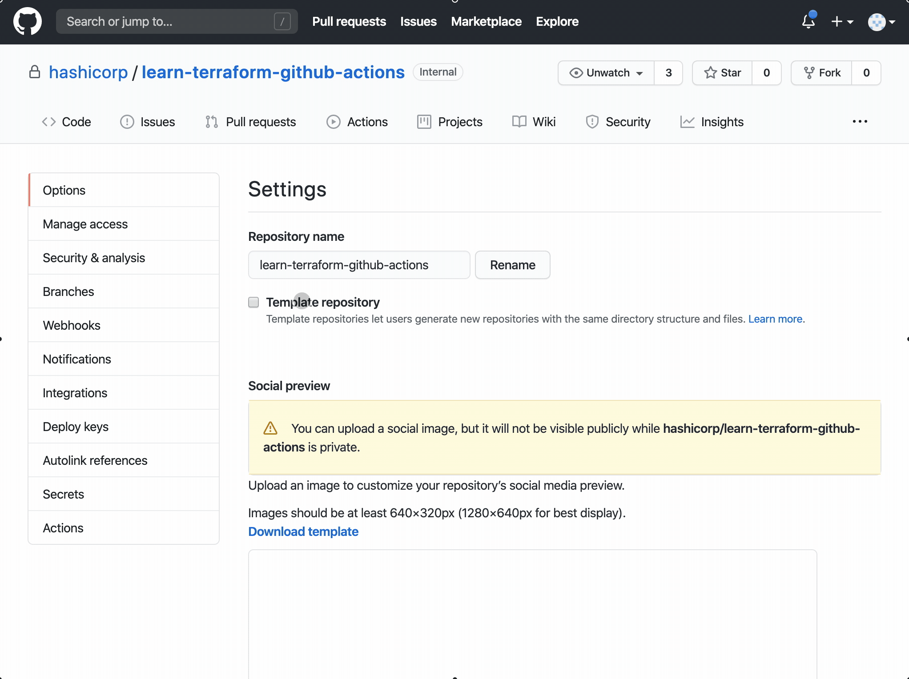

One of my resolutions for 2023 was to write constantly on this blog. I thought a lot about what to bring as my first article.
What better topic than what is behind this site?

In this article we will cover the following topics:

1. Setup the infrastructrue of our website using Terraform, Terraform Cluod and Git Hub Actions 
1. Create a repository for our website using HUGO
2. Create a CI/CD pipeline for our website using Git Hub Actions

#### Prerequisites

- A [Git Hub Account](https://github.com/)
- An [AWS Account](https://aws.amazon.com/it/account/)
- A [Terraform Cloud Account](https://app.terraform.io/session)


Let's begin!

### 1 Setup the infrastructrue of our website using Terraform, Terraform Cluod and Git Hub Actions

Why should we use all these tools? Couldn't we just do some *Click Ops* and build what we needed directly from the AWS interface?

The answer is obviously no, although it is a personal project I have tried to immerse myself in a situation as real as possible. So I started imagining what could happen if not just me but a whole team worked on this project and if we needed to handle a bigger workload.

If I wanted to do things wrong I could host my website on a Raspberry Pi.
But we are Cloud Engineers, we like to **scale**. Right?


Let's try to spend a few words to describe the goals I wanted to achieve and the choices I made to achieve them

### 1.1 Infrastructure as Code (IaC) -> Terraform

I needed something that would allow me to describe my infrastructure as code, as I said above I wanted to avoid *Click Ops*. 
Of all the tools available on the market, I chose Terraform to achieve this goal. What the hell is **Terraform** and why should I use it?

Terraform is a tool for building, changing, and versioning infrastructure safely and efficiently. It can manage infrastructure for a variety of cloud providers, including AWS, Azure, Google Cloud, DigitalOcean, and more, as well as on-premises environments.

With Terraform, you can define infrastructure as code (IaC) and use configuration files to create and manage infrastructure resources. This makes it easier to version control your infrastructure and collaborate with others. Terraform also provides a number of helpful features, such as dependency management, resource targeting, and the ability to roll back changes.

Here you will find the repository that contains the Terraform code for this project: [perosona-website-iac](https://github.com/ettoreciarcia/personal-website-iac.git)

#### Infrastructure Overview


The repository is public, you can clone it using the command

```shell
git clone https://github.com/ettoreciarcia/personal-website-iac.git
```

The Terraform project has this structure

```shell
.

├── .github/
    ├── workflows/
        ├── terraform.yml <-- For Git Hub Actions 
├── modules/
│   ├── infra/  <--- Create infra resources here
│   └── security/ <-- Create IAM reosurce here
├── environemnt/
    ├── prod/
      ├── main.tf <-- Here we call the infra and security modules for resource creation
      ├── variables.tf
      ├── output.tf
      ├── personal-website.auto.tfvars
├── .pre-commit-config.yaml <-- Pre commit check on HCL (fmt)
├── personal-website.auto.tfvars
├── README.md
├── .gitignore

```

If you want to use this code remember to change the values ​​of the variables inside the file ```personal-website.auto.tfvars```. Specifically, you will need to set the following values

```HCL
region              = "YOUR_REGION"
application_name    = "personal-website"
bucket_suffix       = "<CHANGE WITH A NON COMMON STRING-(YOUR SURNAME SHOULD BE OK)>"
environment         = "prod"
acm_certificate_arn = "<YOUR ACM CERTIFCIATE ARN>"
domain_name         = "YOUR_DOMAIN_NAME"
route53_zone_id     = "YOUR_ROUTE_53_ZONE_ID"
```

You can make sure the configuration is ok by moving to the ```environment/prod``` folder and running 

```terraform init```

```terraform validate```

At this point you might be tempted to set up terraform locally and run a ```terraform apply``` with local state management. 


But why do it? If everyone on a team worked with local state, **chaos would reign**.

### 1.2 Terraform Cloud

In this phase we will go one step further because we will not manage the status of our Terraform project locally, but we will use **Terraform Cloud**, a web-based application that provides collaboration, governance, and automation features for teams using Terraform. It is designed to make it easier to use Terraform in a collaborative environment by providing features such as remote state management, version control, and a private module registry.


If you don't have a Terraform Cloud account yet, you can sign up [here](https://app.terraform.io/session)

Then you can create your first workspace! 


Next, add the following as Environment Variables for your workspace with their respective values from the access credentials file you downloaded from AWS.

1. AWS_ACCESS_KEY_ID
2. AWS_SECRET_ACCESS_KEY

Finally, go to the [Tokens page](https://app.terraform.io/app/settings/tokens?utm_source=learn) in your Terraform Cloud User Settings. Click on "Create an API token" and generate an API token named GitHub Actions.



We're done on Terraform Cloud!

### Continuos Integration/Continous Deployment  CI/CD) -> Git Hub Actions

Here the choice was almost forced as my IaC repository is on Git Hub and I have a Premium account which gives me access to free minutes of calculation using GH Actions.
Automating Terraform with CI/CD enforces configuration best practices, promotes collaboration and automates the Terraform workflow.


Maybe the benefits of using Terraform Cloud and Git Hub Actions at the same time aren't apparent in this project because I'm the only one working on it, or if you try to replicate my infrastructure you'll be the only one working on it.

But trust me, in case multiple people from the same team or even different teams are working on the same Terraform project, these additions are almost a must have

At this point you can fork my [repository](https://github.com/ettoreciarcia/personal-website-iac) and import the token created in the previous step



This file define all action in the workflow

```yaml
name: "Terraform"

on:
  push:
    branches:
      - main
  pull_request:

jobs:
  terraform:
    name: "Terraform"
    runs-on: ubuntu-latest
    steps:
      - name: Checkout
        uses: actions/checkout@v3

      - name: Setup Terraform
        uses: hashicorp/setup-terraform@v2
        with:
          # terraform_version: 0.13.0:
          cli_config_credentials_token: ${{ secrets.TF_API_TOKEN }}

      - name: Terraform Format
        id: fmt
        run: terraform fmt -check

      - name: Terraform Init
        id: init
        run: terraform init
      
      - name: Terraform Validate
        id: validate
        run: terraform validate -no-color

      - name: Terraform Plan
        id: plan
        if: github.event_name == 'pull_request'
        run: terraform plan -no-color -input=false
        continue-on-error: true

      - uses: actions/github-script@v6
        if: github.event_name == 'pull_request'
        env:
          PLAN: "terraform\n${{ steps.plan.outputs.stdout }}"
        with:
          github-token: ${{ secrets.GITHUB_TOKEN }}
          script: |
            const output = `#### Terraform Format and Style 🖌\`${{ steps.fmt.outcome }}\`
            #### Terraform Initialization ⚙️\`${{ steps.init.outcome }}\`
            #### Terraform Validation 🤖\`${{ steps.validate.outcome }}\`
            #### Terraform Plan 📖\`${{ steps.plan.outcome }}\`
            <details><summary>Show Plan</summary>
            \`\`\`\n
            ${process.env.PLAN}
            \`\`\`
            </details>
            *Pushed by: @${{ github.actor }}, Action: \`${{ github.event_name }}\`*`;
            github.rest.issues.createComment({
              issue_number: context.issue.number,
              owner: context.repo.owner,
              repo: context.repo.repo,
              body: output
            })
      - name: Terraform Plan Status
        if: steps.plan.outcome == 'failure'
        run: exit 1

      - name: Terraform Apply
        if: github.ref == 'refs/heads/main' && github.event_name == 'push'
        run: terraform apply -auto-approve -input=false
```

This is what happens when your freshly baked code arrives on this repository


Now you can try working on a new branch and then make a Pull Request and see the flow of Git Hub Actions!

Start by creating a new branch in *personal-website-iac* running

```shell
git checkout -b bucket-branch
```

Assuming you want to create a new bucket, you can add the following code to your repository. in file ```modules/infra/main.tf```

```HCL
resource "aws_s3_bucket" "bucket_gh_actions" {
  bucket = "${local.application_name}-${var.bucket_suffix}-test-gh-actions"
}
```

You can push your code to the newly created branch and open a Pull Request!


