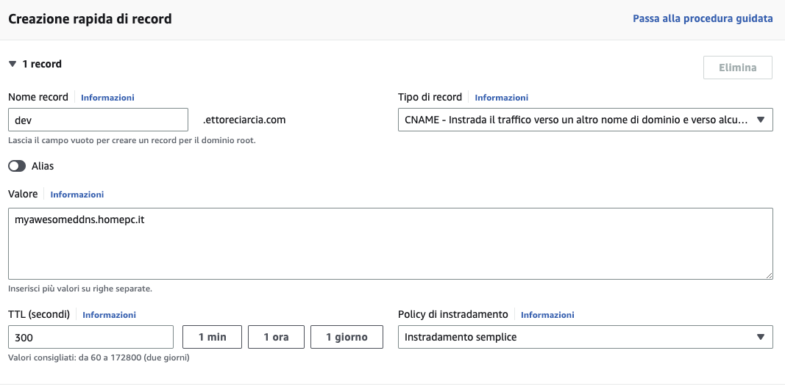
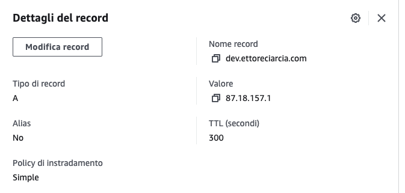

## Intro

When it comes to homelabs that need to be publicly accessible from the outside, all homelabbers face the challenge of making their applications reachable.

Non-commercial contracts that we users enter into do not provide for the assignment of a fixed public IP address.

We, mere mortals, are assigned a public IP address residing in an available IP pool from which our ISP draws before assigning it to us.

This IP is not static; it can be withdrawn after a certain time delta by our ISP or released upon restarting our router, after which a different one is assigned to us.

Therefore, making considerations about the public IP address becomes difficult when it changes.

Let's imagine wanting to expose a service using the DNS name "dev.ettoreciarcia.com," where:

- ```ettoreciarcia.com``` is a valid domain registered on Route53

- ```dev``` is a subdomain of ```ettoreciarcia.com``` to which we need to "link" the public IP we want associated with this subdomain.

Therefore, we anticipate finding an entry in the management panel of our Route53 records that associates the public IP of our homelab with the DNS name ```dev.ettoreciarcia.com```


## What is DDNS

Dynamic DNS (DDNS) is a service that can automatically update DNS records when an IP address changes. Domain names convert network IP addresses to human-readable names for recognition and ease of use. The information mapping the name to the IP address is recorded tabularly on the DNS server. However, network administrators allocate IP addresses dynamically and change them frequently. A DDNS service updates the DNS server records every time IP addresses change. With DDNS, domain name management becomes easier and more efficient.

### How to use DDNS for your homelab

The fortunate ones have a router that supports Dynamic Domain Name System (DDNS). In this scenario, it's straightforward: configure DDNS within the router and link the DDNS in the Route53 entry.

Assuming we've registered our DDNS with a DDNS provider, we would obtain a DDNS like ```myddns.homepc.it```. All that's needed is to create an alias in the Route53 control panel linking ```dev.ettoreciarcia.com``` to ```myddns.homepc.it```, and we're good to go.



## What if our router doesn't support DDNS?

In this case, we need to strive for a result similar to what was seen in the previous section.

The problem remains the same: we have to somehow link dev.ettoreciarcia.com to our public IP address, knowing that it changes. However, this time, we cannot rely on our DDNS.

We need to establish a system that detects changes in our public IP, and this system cannot be "external." If it were external, we would lose connections to it in the event of a public IP change.

The best strategy is to use one of the clients that connect to the internet on our behalf to perform the check.

We can determine our current public IP address from the terminal using the command:

```bash
curl ifconfig.me
``` 

So, wanting to automate this process, we can build a script around this information.

And that's what I was doing—I was writing a bash script that I would then schedule as a crontab job to update the public IP associated with the DNS record on Route53. However, I realized I was essentially reinventing the wheel.

## ddns-rout53

This project does exactly what we need, and it does it in various ways! It's always nice to know that the wheel we were trying to invent has already been invented by someone else.

## Prerequisites

Before proceeding, we need to create a user for programmatic access to the AWS CLI with the necessary permissions to edit the Route53 records we're interested in.

Let's start with the IAM policy:

```json
{
    "Version": "2012-10-17",
    "Statement": [
        {
            "Action": [
                "route53:ChangeResourceRecordSets",
                "route53:ListResourceRecordSets"
            ],
            "Effect": "Allow",
            "Resource": "arn:aws:route53:::hostedzone/<HOSTED_ZONE_ID>"
        }
    ]
}
``` 

Now go to the IAM Users page and click the Add user button.

Enter a User name, check Programmatic access for Access type and click Next: Permissions.

Choose the last option Attach existing policies directly and fill in the Search field with the name of the policy you created before and click Next: Review then Create user.

An Access Key ID and a Secret Access key will be displayed. This is the credentials needed for ddns-route53. Save them somewhere since you will need them in the configuration step.

### The Container Way


This repository has a nice Dockerfile (what a joy to find one), so we can run all this stuff in a convenient container. In our case, we'll use Docker Compose.

Let's go ahead and create the docker-compose.yml file:

``` yaml
version: "3.5"

services:
  ddns-route53:
    image: crazymax/ddns-route53:latest
    container_name: ddns-route53
    environment:
      - "TZ=Europe/Rome"
      - "SCHEDULE=*/30 * * * *"
      - "LOG_LEVEL=info"
      - "LOG_JSON=false"
      - "DDNSR53_CREDENTIALS_ACCESSKEYID=<YOUR_ACCESS_KEY_ID>"
      - "DDNSR53_CREDENTIALS_SECRETACCESSKEY=<YOUR_SECRET_ACCESS_KEY>"
      - "DDNSR53_ROUTE53_HOSTEDZONEID=<YOUR_HOSTED_ZONE_ID>"
      - "DDNSR53_ROUTE53_RECORDSSET_0_NAME=myddns.example.com"
      - "DDNSR53_ROUTE53_RECORDSSET_0_TYPE=A"
      - "DDNSR53_ROUTE53_RECORDSSET_0_TTL=300"
    restart: always
``` 

At this point, all that's left is to run a

```bash
docker-compose up -d
``` 

Our container is running! Let's take a look at the logs to ensure there are no issues

```bash
docker logs ddns-route53
``` 

```bash
Sun, 07 Jan 2024 10:13:44 UTC INF Starting ddns-route53 version=v2.11.0
Sun, 07 Jan 2024 10:13:44 UTC INF Configuration loaded from 6 environment variables
Sun, 07 Jan 2024 10:13:47 UTC INF Current WAN IPv4: 87.18.157.1
Sun, 07 Jan 2024 10:13:48 UTC INF 1 record(s) set updated changes={"ChangeInfo":{"Comment":"Updated by ddns-route53 v2.11.0 at 2024-01-07 10:13:48","Id":"/change/C100496219UGOE0OREMIB","Status":"PENDING","SubmittedAt":"2024-01-07T10:13:48.978Z"},"ResultMetadata":{}}
Sun, 07 Jan 2024 10:13:48 UTC INF Cron initialized with schedule */30 * * * *
Sun, 07 Jan 2024 10:13:48 UTC INF Next run in 16 minutes 11 seconds (2024-01-07 10:30:00 +0000 UTC)
```

and check in our AWS console that the record has been updated correctly




We're done! Don't forget to leave a ⭐ on the [GitHub project](https://github.com/crazy-max/ddns-route53/)

### Other possibile configurations

For brevity, I've only covered one possible configuration using a container, but I'd like to point out two other well-documented options:

- [Installation from Binary](https://crazymax.dev/ddns-route53/install/binary/)

- [Service on Debian Based Distro](https://crazymax.dev/ddns-route53/install/linux-service/)